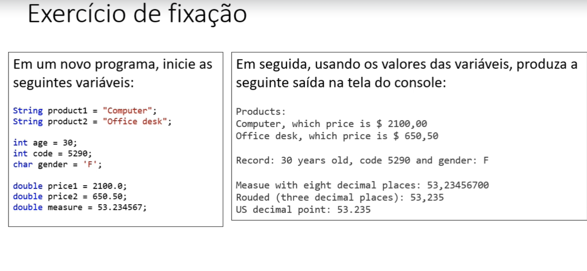
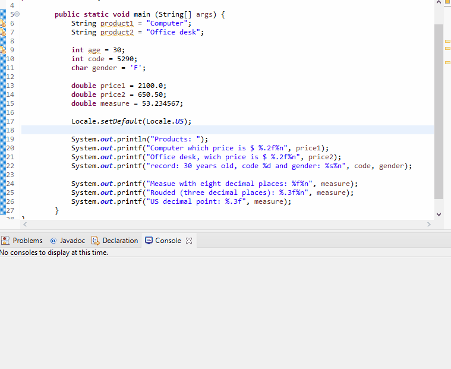
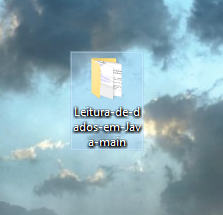
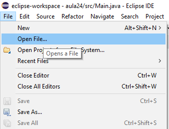
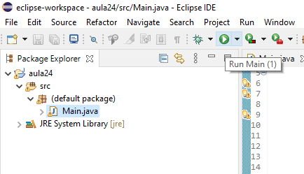

# README

<h3>Leitura de dados formatados em Java</h3>

    <a href="#sobre">Sobre</a>
    <a href="#ide">IDE</a>
    <a href="#versão do java">Versão do Java</a>
    <a href="#instruções">Instruções</a>

# Sobre

Esse simples projeto busca demonstrar a saída de dados formatados em Java e foi criado de acordo com o seguinte enunciado:

 

 

Assim, seguindo as instruções, obteve-se o seguinte resultado no console da IDE:
 
 

 
 

# IDE 
 

Para a realização do exercício proposto foi utilizada a IDE Eclipse em sua versão "Eclipse IDE for Java Developers - 2021-06" para Windows x64.
 
 
Essa IDE pode ser encontrada, gratuitamente, para download em: https://www.eclipse.org/downloads/packages/installer
 
 

# Versão do Java

Utilizou-se a versão Java SE LTS Development Kit 11.0.12, para Windows x64, disponível para download gratuito em https://www.oracle.com/br/java/technologies/javase-jdk11-downloads.html

# Intsruções

Tendo instalado a IDE e a versão do Java, descritos anteriormente, agora é hora de baixar esse projeto em sua máquina.

<h3>1° Crie uma pasta em um diretório</h3> 

 

<h3>2° Abra o projeto em sua IDE:</h3>

 

<h3>3° Execute o aquivo "Main.java" dentro da pasta "src"</h3> 

 
